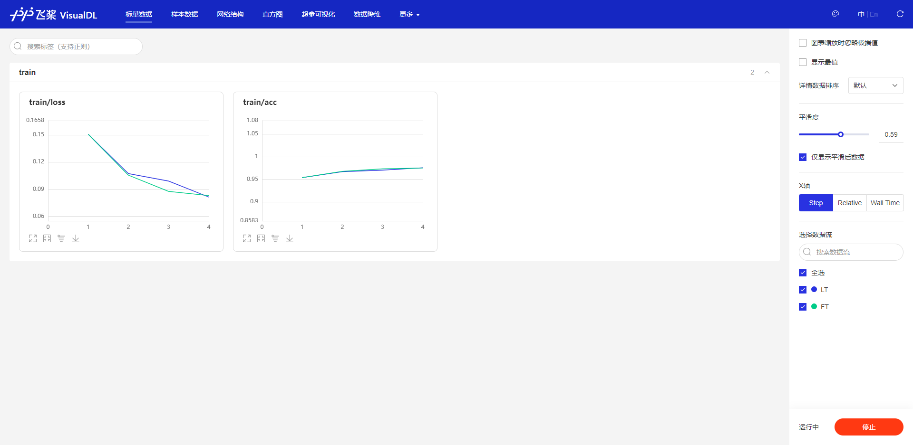

## Metrics Visualization

We have integrated [VisualDL](https://github.com/PaddlePaddle/VisualDL) inside iflearner, so you can visualize training metrics with it. When you have finished training, there will be a directory called "metric" under your training code directory. You can start [VisualDL](https://github.com/PaddlePaddle/VisualDL) with the following command:

```
visualdl --logdir ./metric --host 127.0.0.1 --port 8082
```

Then, open the link http://127.0.0.1:8082 in your browser.



