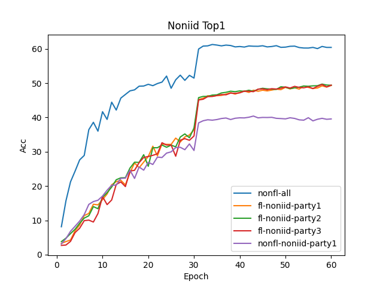
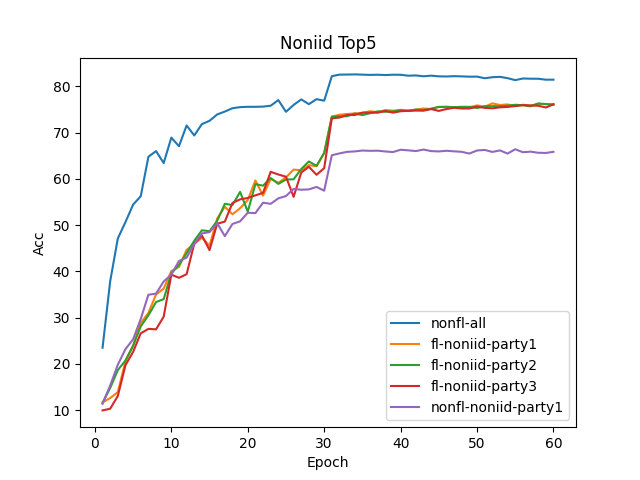
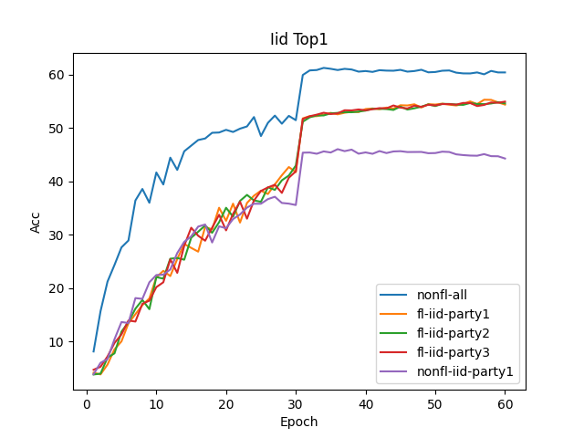
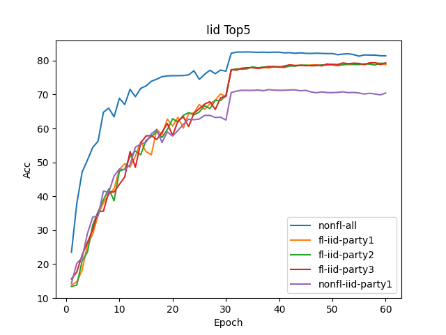

# Imagenet

原始训练代码来自pytorch官方开源的[imagenet示例](https://github.com/pytorch/examples/tree/main/imagenet)中，根据我们的联邦学习训练框架进行了改造，以支持联邦学习的训练。


## 如何改造原始训练代码

参见我们联邦学习框架的集成开发文档


## 准备数据集

由于完整的imagenet数据集过大，我们这里准备了一份几百兆的小数据集。包含200个分类，每个分类训练集和验证集分别为500张图片和50张图片。我们将训练集按照独立同分布和非独立同分布两种方式各分成3份等量的训练集，其中非独立同分布按照每个参与方50、100和350张图片在200个分类中循环。


## 启动服务端

```
PYTHONPATH=$pwd python iflearner/business/homo/aggregate_server.py -a 3
```

`-a 3`: 表示有三个参与方


## 启动客户端

分别启动3个客户端

```
PYTHONPATH=/data1/shengxu8/projects/iflytek/iflearner python imagenet.py -a resnet18 /data1/shengxu8/projects/iflytek/data/tiny-imagenet-200-iid-0 --name iid-client01 --epochs 60 --server "0.0.0.0:50001" --peers "0.0.0.0:50012;0.0.0.0:50013;0.0.0.0:50014"

PYTHONPATH=/data1/shengxu8/projects/iflytek/iflearner python imagenet.py -a resnet18 /data1/shengxu8/projects/iflytek/data/tiny-imagenet-200-iid-1 --name iid-client02 --epochs 60 --server "0.0.0.0:50001" --peers "0.0.0.0:50013;0.0.0.0:50012;0.0.0.0:50014"

PYTHONPATH=/data1/shengxu8/projects/iflytek/iflearner python imagenet.py -a resnet18 /data1/shengxu8/projects/iflytek/data/tiny-imagenet-200-iid-2 --name iid-client03 --epochs 60 --server "0.0.0.0:50001" --peers "0.0.0.0:50014;0.0.0.0:50012;0.0.0.0:50013"
```

`--name`: 客户端名称
`--epochs`: 训练轮数
`--server`: 需要连接的服务端地址
`--peers`: 启动SMPC聚合方式，需要指定所有的客户端地址，其中第一个是自己监听的地址

## 结果分析

按照两种数据分布，分别统计聚合数据的训练、联邦学习训练以及单参与方训练下的Top1和Top3的acc值。
    

* 数据非独立同分布

    

    

    可以看出无论Top1或者Top5的acc值，聚合数据的训练>联邦学习训练>单参与方训练，总体结果符合预期。

* 数据独立同分布

    

    

    可以看出无论Top1或者Top5的acc值，聚合数据的训练>联邦学习训练>单参与方训练，但是在联邦学习场景下，数据独立同分布的结果要好于数据非独立同分布，总体结果符合预期。